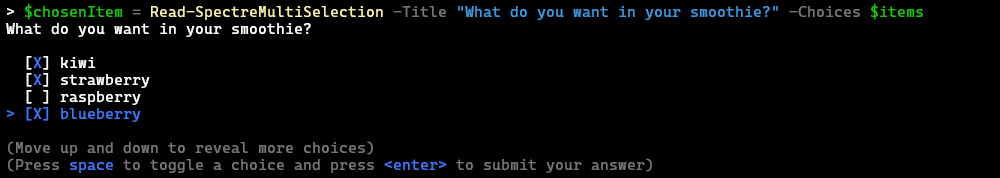

### Demo

PwshSpectreConsole includes an interactive demo of most of the available functionality. The demo shows code blocks above each example to demonstrate the functions available. 

Start the interactive demo by running:

```powershell
PS> Start-SpectreDemo
```


### Using Prompts

The easiest way to get started with PwshSpectreConsole is to create a select-list like the one shown on the homepage. If you have a list of items you want a user to choose from you can store them in an array and then pass it to [Read-SpectreSelection](../reference/read-spectreselection) to ask the user to choose one:

```powershell
# Start by creating your list of items
$items = @("apple", "banana", "pear", "orange", "grape",
           "kiwi", "strawberry", "raspberry", "blueberry")

# Ask the user what they want
$chosenItem = Read-SpectreSelection -Title "What do you want to eat?" -Choices $items

# Do something with the chosen item
Write-Host "You chose '$chosenItem'"
```

> Example of a user being prompted with a select list:
> 

But what if you wanted to ask the use what they want for something like a fruit smoothie? You can use [Read-SpectreMultiSelection](../reference/read-spectremultiselection) to ask them to choose multiple items from the list:

```powershell
# Start by creating your list of items
$items = @("apple", "banana", "pear", "orange", "grape",
           "kiwi", "strawberry", "raspberry", "blueberry")

# Ask the user what they want
$chosenItem = Read-SpectreMultiSelection -Title "What do you want in your smoothie?" -Choices $items

# Do something with the chosen item
Write-Host "You chose '$chosenItem'"
```

> Example of a user being prompted with a multi-select list:
> 

### More

- Most Spectre console functions can render a special markup language allowing you to easily write content with different colored text and emoji [https://spectreconsole.net/markup](https://spectreconsole.net/markup)
- For more information on how to use prompts and other Spectre Console interactions, see the [command reference](/reference/config/set-spectrecolors/).
