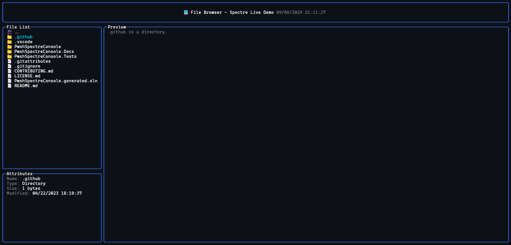

## 🚀 Get the New Version

```powershell
# Install the latest version
Install-Module PwshSpectreConsole -Scope CurrentUser
# or update your existing version to the latest
Update-Module PwshSpectreConsole -Scope CurrentUser
```

## 💥 Breaking Changes

- **[`Out-SpectreHost`](/reference/writing/out-spectrehost/) is required if you want to render an item without additional whitespace above and below the item:**  
  - To enable the new features, the way the console handles the default host output has changed. Version 2 uses [powershell formatting](https://learn.microsoft.com/en-us/powershell/module/microsoft.powershell.core/about/about_format.ps1xml?view=powershell-7.4) to render Spectre Console objects. When rendered to the terminal PowerShell pads these with a blank line before and after the renderable item.  
  `$data | Format-SpectrePanel | Out-SpectreHost` will force the object to be rendered without padding.  

## 🗑️ Deprecations

- **[`Format-SpectreJson`](/reference/formatting/format-spectrejson/) has had parameters deprecated:**
  - `-NoBorder`, `-Border`, `-Color`, `-Title`, `-Width`, and `-Height` parameters no longer take any effect and will be removed in a future version.  
  To wrap the json in a border you can now pipe the output to Format-SpectrePanel e.g. `Format-SpectreJson -Data $data | Format-SpectrePanel`

## 🆕 New Features

### Renderables

Renderables are objects that can be rendered to the console. Most functions now return a renderable object instead of writing directly to the console host. This allows you to assign the output of a function to a variable and use it in other functions or redirect the output to a file. The renderable objects can also be used as inputs to other Spectre Console functions so you can build complex layouts.


```powershell
# Example of using renderable objects inside a table
$calendar = Write-SpectreCalendar -Date (Get-Date) -PassThru
$files = Get-ChildItem | Format-SpectreTable
$fruits = @(
    (New-SpectreChartItem -Label "Bananas" -Value 2.2 -Color Yellow),
    (New-SpectreChartItem -Label "Oranges" -Value 6.6 -Color Orange1),
    (New-SpectreChartItem -Label "Apples" -Value 1 -Color Red)
) | Format-SpectreBarChart -Width 45

@{
    Calendar = $calendar
    Files = $files
    Fruits = $fruits
} | Format-SpectreTable -Color Cyan1
```

### Live Rendering

The `Invoke-SpectreLive` function allows you to run a scriptblock and update a renderable item live in real-time. This allow you to build simple terminal user interfaces or live updating dashboards.  

See the documentation for [`Invoke-SpectreLive`](/reference/live/invoke-spectrelive/) for more information and examples.  



### All New Commandlets

New commandlets to make this PowerShell library compatible with the rest of the Spectre.Console C# library:

- [`Add-SpectreTableRow`](/reference/formatting/add-spectretablerow/) - Add a row to an existing table.
- [`Format-SpectreAligned`](/reference/formatting/format-spectrealigned/) - Set the alignment for an item inside a panel/layout.
- [`Format-SpectreColumns`](/reference/formatting/format-spectrecolumns/) - A method for rendering an array of items in automatically layed out columns.
- [`Format-SpectreRows`](/reference/formatting/format-spectrerows/) - Render an array of items in rows.
- [`Format-SpectreGrid`](/reference/formatting/format-spectregrid/) - Render an array of items in a grid.
- [`New-SpectreGridRow`](/reference/formatting/new-spectregridrow/) - Create a new row for a grid from an array of columns.
- [`Format-SpectrePadded`](/reference/formatting/format-spectrepadded/) - Surround an item with whitespace.
- [`Format-SpectreTextPath`](/reference/formatting/format-spectretextpath/) - Render a file/folder path with syntax highlighting.
- [`Format-SpectreException`](/reference/formatting/format-spectreexception/) - Render an exception with syntax highlighting.
- [`Invoke-SpectreLive`](/reference/live/invoke-spectrelive) - Run a scriptblock and update a renderable item live in real-time.
- [`New-SpectreLayout`](/reference/formatting/new-spectrelayout/) - For rendering items in nested layouts.
- [`Get-SpectreDemoFeatures`](/reference/demo/get-spectredemofeatures/) - A demo of the features of Spectre.Console available in PwshSpectreConsole.

### Updated Commandlets

- `Read-*` - Most "read" functions now accept a `-TimeoutSeconds` parameter after which, null is returned.
- `Write-*` - Most "write" functions now have a `-PassThru` switch parameter that will return the renderable object instead of writing it to the host immediately.

### What about the Canvas Widget?

The [canvas](https://spectreconsole.net/widgets/canvas) widget is the lonely remaining widget that doesn't have a function to access it in this module. It is accessible enough that it doesn't make sense to implement in PowerShell. If you need to use it you can use the C# library directly e.g.

```powershell
# Create a canvas
$canvas = [Spectre.Console.Canvas]::new(16, 16)

# Draw some shapes
for($i = 0; $i -lt $canvas.Width; $i++) {
    # Cross
    $canvas = $canvas.SetPixel($i, $i, [Spectre.Console.Color]::White)
    $canvas = $canvas.SetPixel($canvas.Width - $i - 1, $i, [Spectre.Console.Color]::White)

    # Border
    $canvas = $canvas.SetPixel($i, 0, [Spectre.Console.Color]::Red)
    $canvas = $canvas.SetPixel(0, $i, [Spectre.Console.Color]::Green)
    $canvas = $canvas.SetPixel($i, $canvas.Height - 1, [Spectre.Console.Color]::Blue)
    $canvas = $canvas.SetPixel($canvas.Width - 1, $i, [Spectre.Console.Color]::Yellow)
}

# Render the canvas
$canvas | Out-SpectreHost
```
